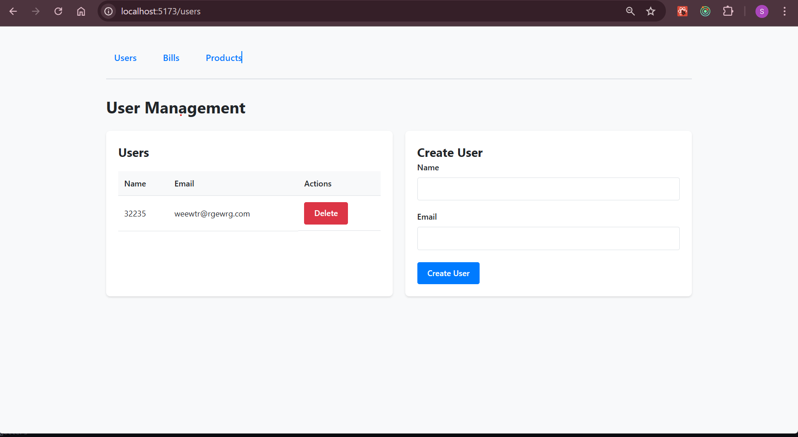
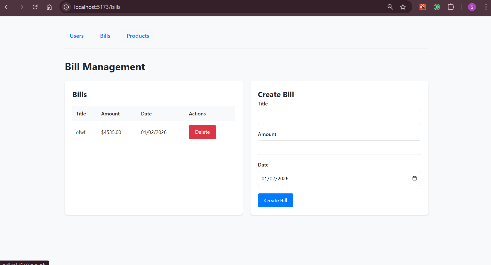
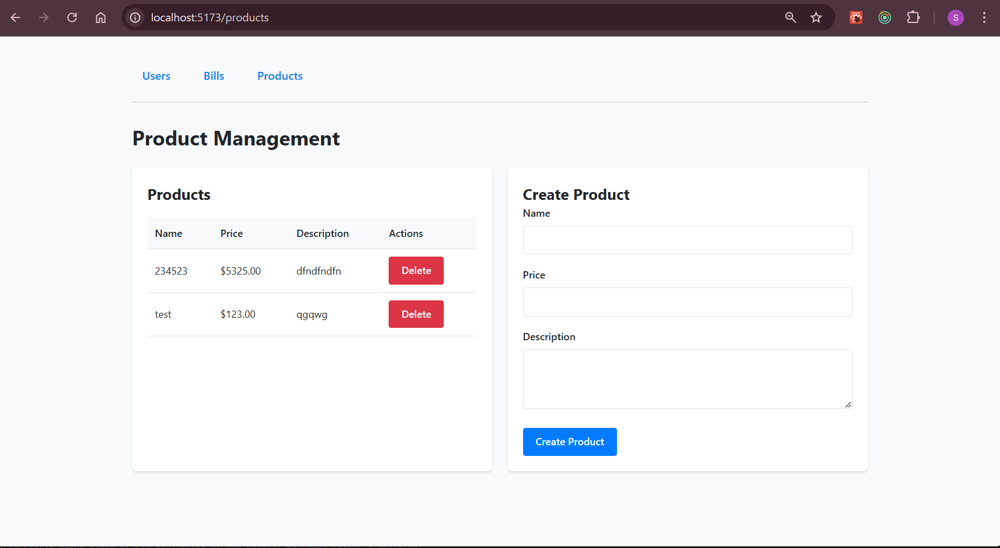

# React Training Project

A full-stack training project for learning React 19, Redux, Redux Saga, and modern frontend development practices.

## Tech Stack

### Frontend
- React 19
- TypeScript
- Vite
- Redux Toolkit
- Redux Saga
- CSS (with global reset)

### Backend
- Node.js
- Express
- lowdb
- TypeScript

## Architecture

- **Feature Slice Pattern**: Code is organized by features
- **Redux + Saga**: All API calls go through Redux actions and Saga middleware
- **TypeScript**: 100% TypeScript codebase

## Getting Started

### Install Dependencies
```bash
npm run install:all
```

### Development
```bash
npm run dev
```

This will start both frontend (http://localhost:5173) and backend (http://localhost:3000) servers.

### Build
```bash
npm run build
```

## Project Structure

```
react-exos/
├── frontend/
│   ├── src/
│   │   ├── pages/
│   │   │   ├── user/
│   │   │   ├── bill/
│   │   │   └── product/
│   │   ├── store/
│   │   └── styles/
│   └── ...
├── backend/
│   ├── src/
│   │   ├── routes/
│   │   ├── database/
│   │   └── ...
│   └── ...
└── ...
```

## Features

- **User Management**: CRUD operations for users
- **Bill Management**: CRUD operations for bills with user associations
- **Product Management**: CRUD operations for products with bill associations

## Database Schema

- **users**: User information
- **bills**: Bill information
- **products**: Product information
- **bill_users**: Join table for bills and users
- **bill_products**: Join table for bills and products


Your mission : 

I need you to create a dashboards that help manager to have a quick view on how many products, users we have in database
this dashboard must be the first page that the manager lands on on opening the app.
you can have quick access to users and products.

Pain point:
Thi app has a basic bill creation page but our CEO requires the salles people be able to : 
- in the same page to select one user then he can create an invoice.
- in this invoice section they can add as many products as we wants
- the pages should auto compute the sub total 
- add a VAT input which is 8.1 % by default
- that's applies automatically to the grand total
- You can decide of the most efficient Layout  for your sales peoples that will use this app so they're efficient in their duties.

there are the current app pages:



